# 💰 FinanceFlow - Визуальный трекер финансовых целей

[]() []() []()
[]() []() []()

---

<p align="center">
  <a href="README_EN.md">Read in English 🇺🇸</a>
</p>

**FinanceFlow** — это профессиональный десктопный трекер финансовых целей. Приложение разработано для тех, кто хочет визуализировать свои накопления, следить за прогрессом в реальном времени и получать детальную аналитику в формате PDF.

В отличие от обычных Excel-таблиц, FinanceFlow предоставляет современный графический интерфейс, защиту от ошибок ввода и геймифицированный подход к накоплениям.

---

### **Оглавление**

1.  [Функционал](#функционал)
2.  [Технологии](#технологии)
3.  [Установка и База Данных](#установка-и-база-данных)
4.  [Сборка и Запуск](#сборка-и-запуск)
5.  [Галерея](#галерея)

---

### **Функционал**<a id="функционал"></a>

- 🎯 **Управление целями:** Создание целей с картинками, категориями и приоритетами. Полный цикл CRUD (Создание, Чтение, Обновление, Удаление).

- 💳 **История операций:** Внесение депозитов, редактирование истории пополнений. Прогресс-бар пересчитывается автоматически.
- 📊 **Аналитика:** Дашборд с круговой диаграммой (цвета генерируются динамически), статистика накоплений и список ближайших дедлайнов.
- 📄 **Отчетность:** Генерация профессионального PDF-отчета со сводкой и таблицами. Файлы сохраняются в папку `Документы/FinanceFlow-Отчеты`.
- 🛡️ **Безопасность данных:** Система валидации предотвращает ввод некорректных данных (например, отрицательных сумм или неверных дат), выводя понятные уведомления.

---

### **Технологии**<a id="технологии"></a>

Проект построен на актуальном стеке технологий. Нажмите на технологию, чтобы перейти на официальный сайт загрузки.

- **Язык:** [C# / .NET 8.0](https://dotnet.microsoft.com/en-us/download/dotnet/8.0) — Основная платформа.
- **UI Фреймворк:** [AvaloniaUI 11.3.8](https://avaloniaui.net/) — Кроссплатформенный XAML (архитектура MVVM).
- **База данных:** [PostgreSQL 16+](https://www.postgresql.org/download/) — Надежная реляционная СУБД.
- **ORM:** [Entity Framework Core 8](https://learn.microsoft.com/en-us/ef/core/) — Работа с данными через объекты.
- **PDF:** [QuestPDF](https://www.questpdf.com/) — Генерация документов (Community License).

---

### **Установка и База Данных**<a id="установка-и-база-данных"></a>

⚠️ **Важно:** Для работы приложения необходим установленный сервер PostgreSQL.

**Учетные данные по умолчанию:**
Приложение настроено на подключение со следующими данными:

- **Database:** `financeflow_db`
- **User:** `financeflow_user`
- **Password:** `Ff_Postgres_Mdk_2025!`

> Если вы хотите использовать свой логин/пароль, откройте файл `Data/AppDbContext.cs` и измените строку подключения в методе `OnConfiguring`.

#### **Способ 1: Автоматическая настройка (Windows)**

В корне проекта находится файл `setup_db.bat`.

1.  Запустите его от имени администратора (или просто двойным кликом).
2.  Скрипт автоматически:
    - Создаст пользователя и базу данных.
    - **Создаст структуру таблиц.**
    - Наполнит базу тестовыми категориями из файла `seed_data.sql`.
      _(Требуется, чтобы PostgreSQL был в переменных среды PATH)_.

#### **Способ 2: Ручная настройка (SQL)**

Если вы предпочитаете настраивать БД вручную (через pgAdmin или psql):

1.  **Создание базы и пользователя:**

    ```sql
    CREATE USER financeflow_user WITH PASSWORD 'Ff_Postgres_Mdk_2025!';
    CREATE DATABASE financeflow_db OWNER financeflow_user;
    ALTER USER financeflow_user CREATEDB;
    ```

2.  **Создание таблиц и наполнение:**
    Найдите в корне проекта файл `seed_data.sql` и выполните его содержимое в созданной базе `financeflow_db`. Этот скрипт создаст все необходимые таблицы и добавит категории целей.

#### **Полезные скрипты в проекте:**

- `seed_data.sql` — Полный скрипт инициализации (удаление старого, создание таблиц, вставка данных).
- `cleanup.sql` — Скрипт для полной очистки базы (Drop All).

---

### **Сборка и Запуск**<a id="сборка-и-запуск"></a>

#### **Вариант А: Готовый EXE (Без установки .NET)**

Идеально для демонстрации на компьютере без инструментов разработчика.

1.  Перейдите в раздел **[Releases](../../releases)** этого репозитория.
2.  Скачайте архив `FinanceFlow_Release.zip`.
3.  Запустите `FinanceFlow.exe`.

#### **Вариант Б: Запуск из исходного кода**

Требуется установленный .NET 8 SDK.

1.  **Клонирование:**

    ```bash
    git clone https://github.com/RamenOfficialGovPatsy/FinanceFlow.git
    cd FinanceFlow
    ```

2.  **Настройка БД (через EF Core):**
    Если вы не использовали SQL-скрипты выше, можно создать структуру таблиц командой:

    ```bash
    dotnet ef database update
    ```

3.  **Запуск:**
    ```bash
    dotnet run
    ```

---

### **🖼️ Галерея**<a id="галерея"></a>

### Основная панель и Обзор целей

[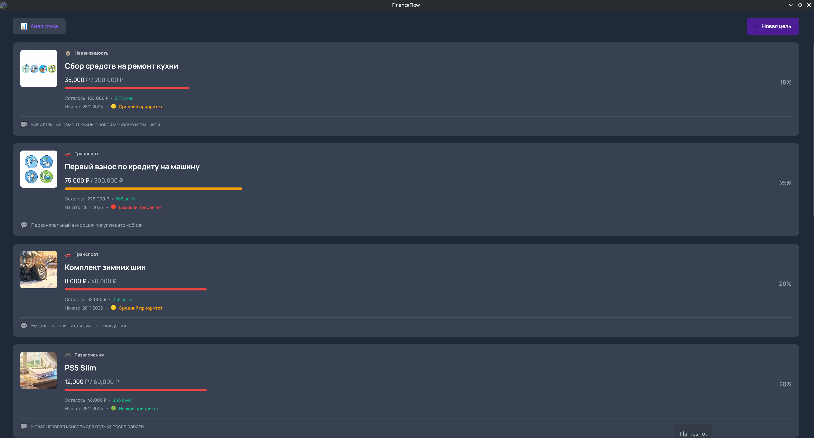](screenshots/1_main_dashboard.png)
_Главное меню с обзором целей и прогресс-баром_

### Управление целями

[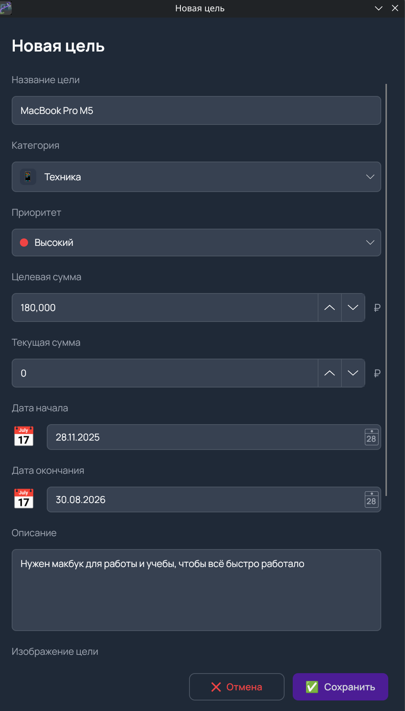](screenshots/5_goal_create_top.png)
_Форма создания ноовой цели_

[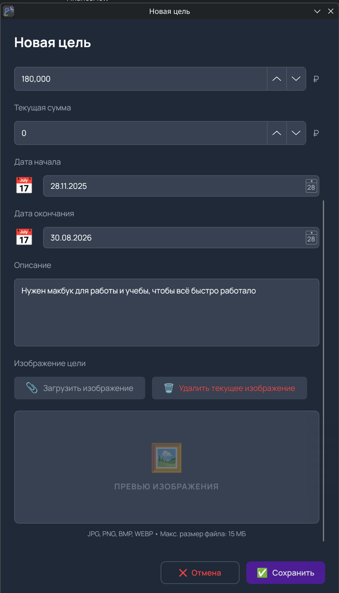](screenshots/6_goal_create_bottom.png)
_Форма создания ноовой цели(часть2)_

### Учет пополнений и История операций

[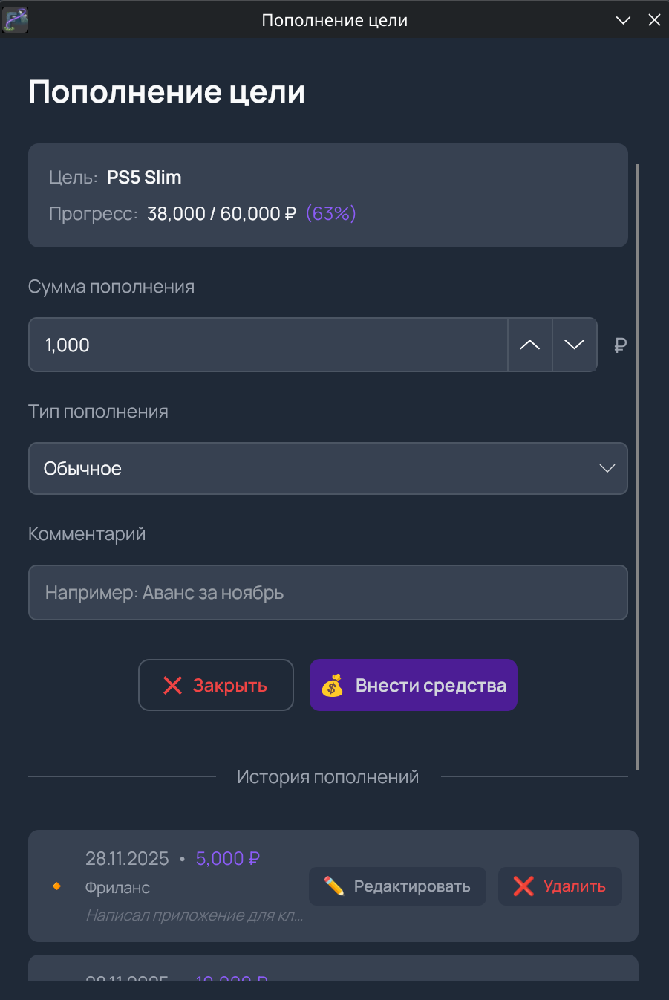](screenshots/7_deposit_form.png)
_Внесение средств_

[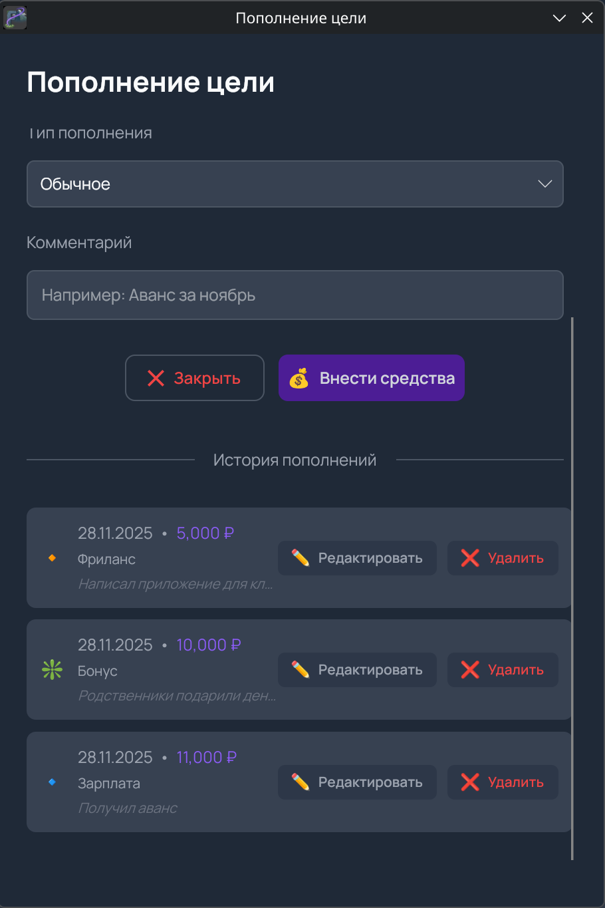](screenshots/8_deposit_history.png)
_Журнал транзакций_

### Аналитика и Детализация

[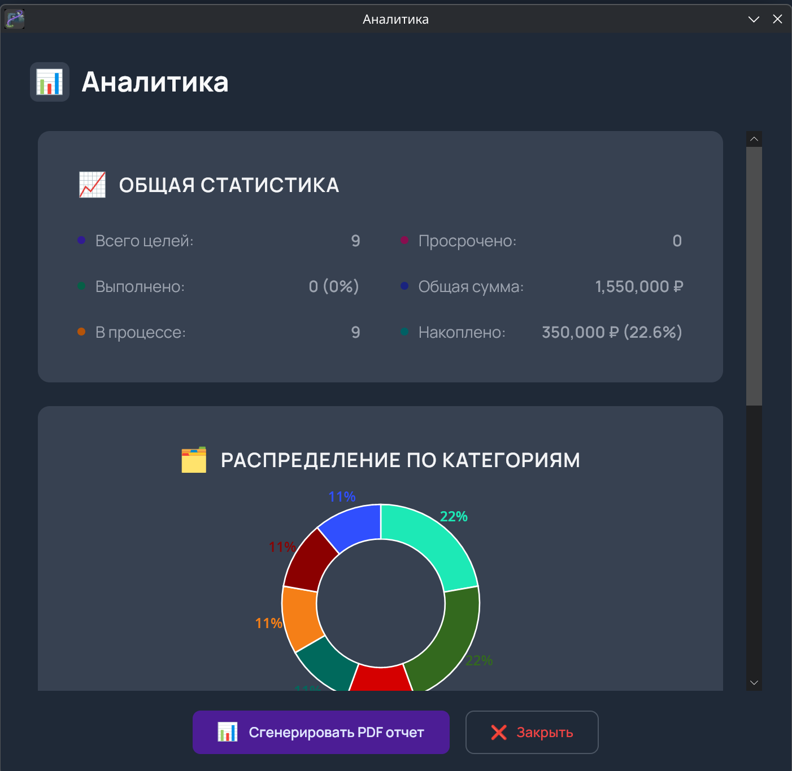](screenshots/2_analytics_view.png)
_Общая статистика_

[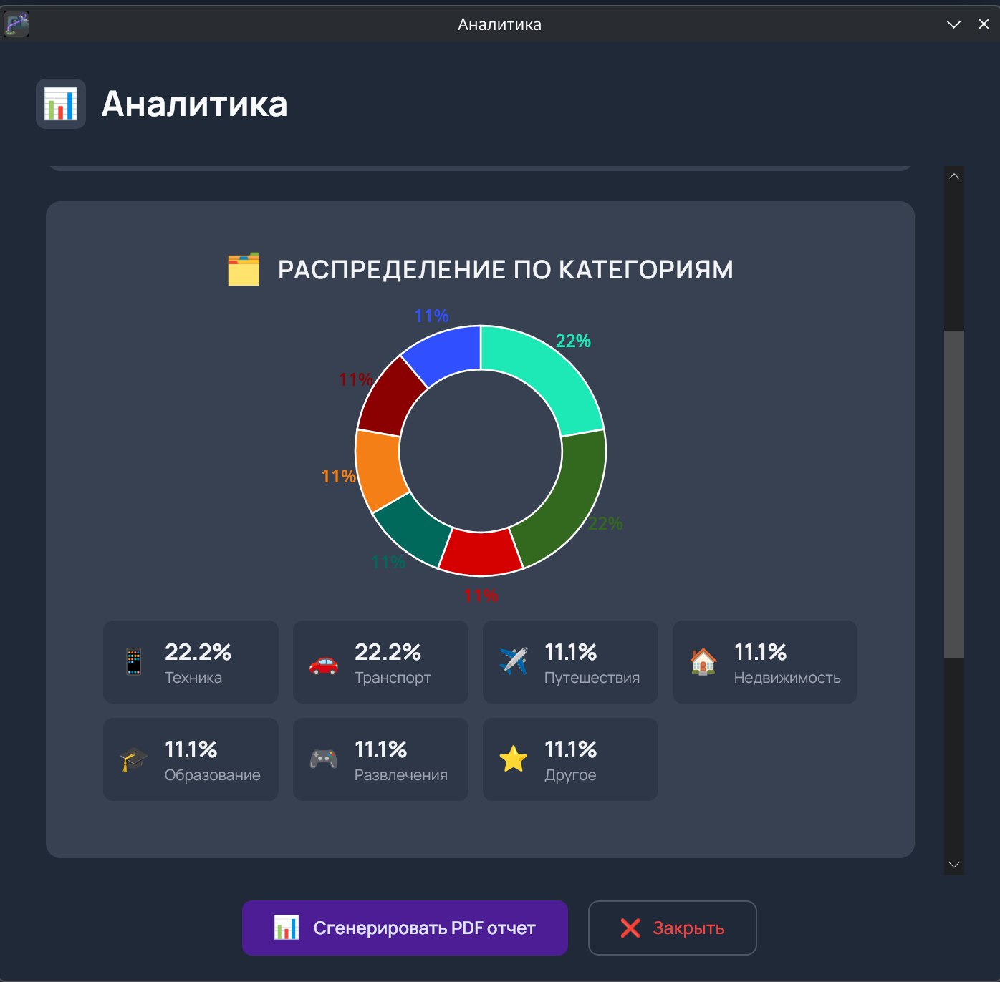](screenshots/3_analytics_chart.png)
_Распределение по категориям_

[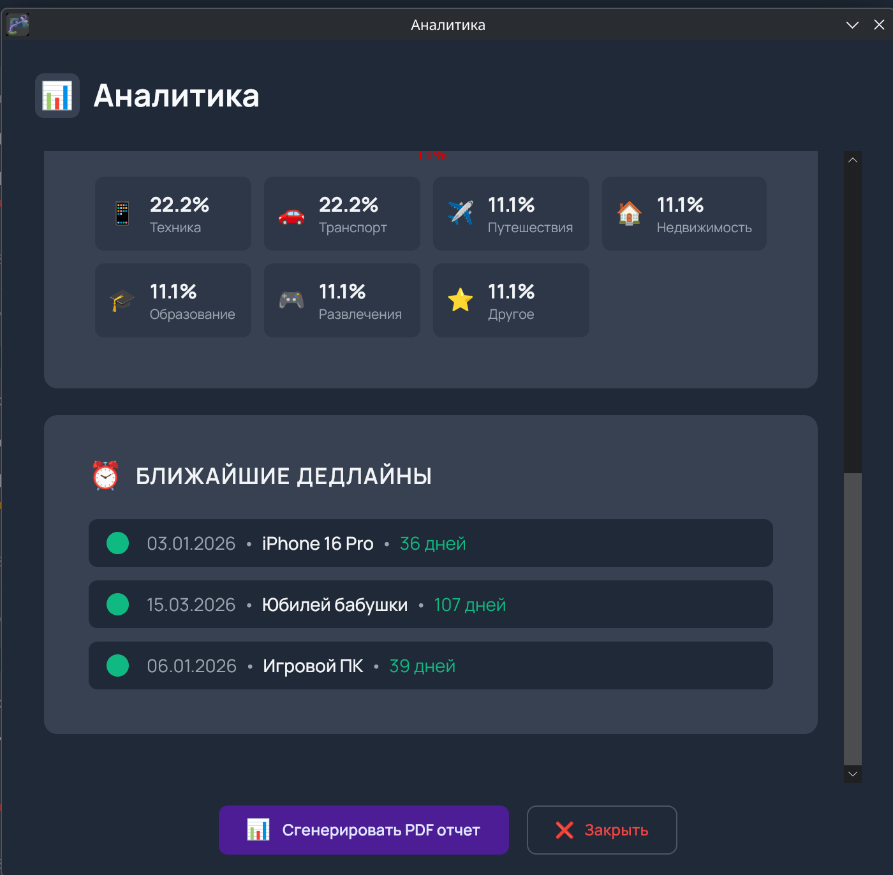](screenshots/4_analytics_deadlines.png)
_Дедлайны_

### Отчетность

[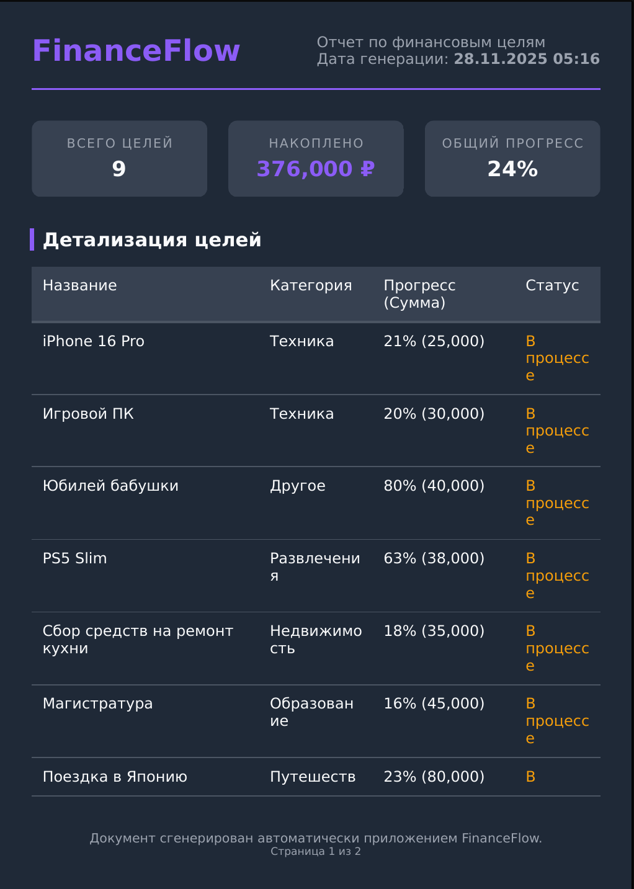](screenshots/9_report_preview_summary.png)
_1 страница отчета_

[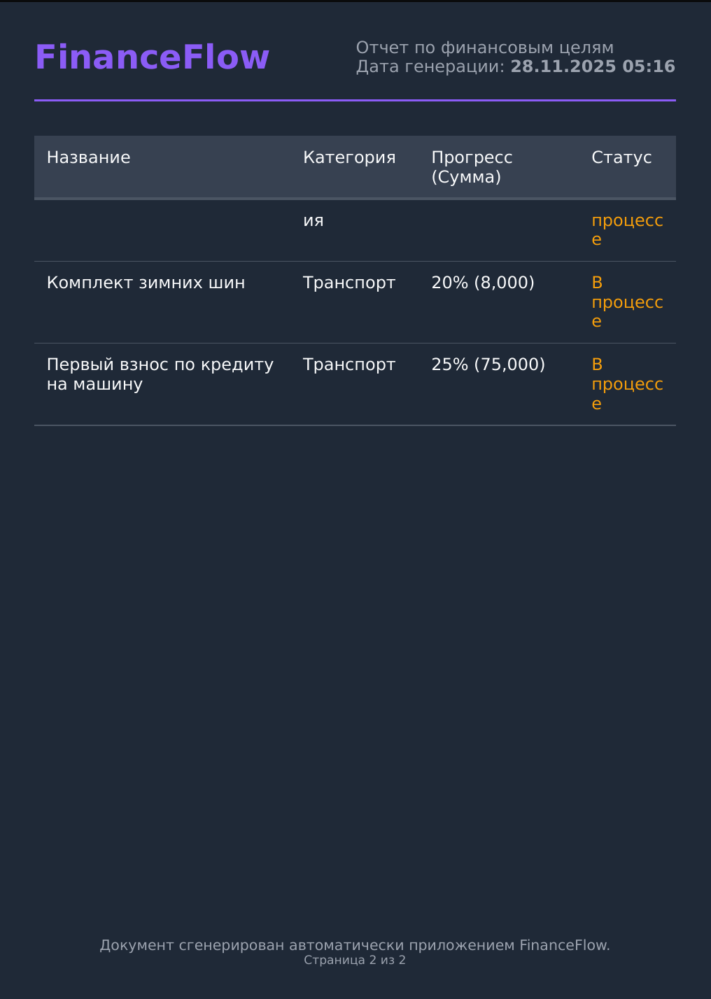](screenshots/10_report_preview_table.png)
_2 страница отчета_

### Демонстрация Валидации

[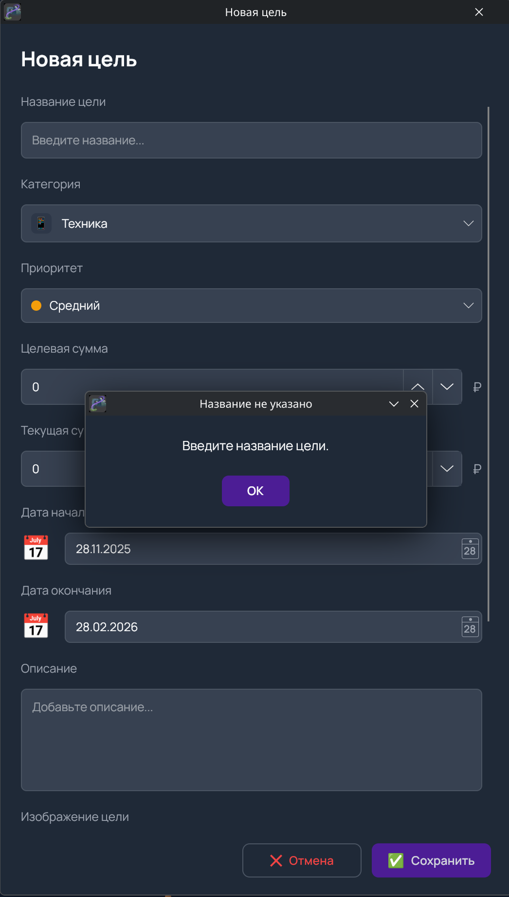](screenshots/11_error_empty_name.png)
_Проверка обязательных полей - название цели_

[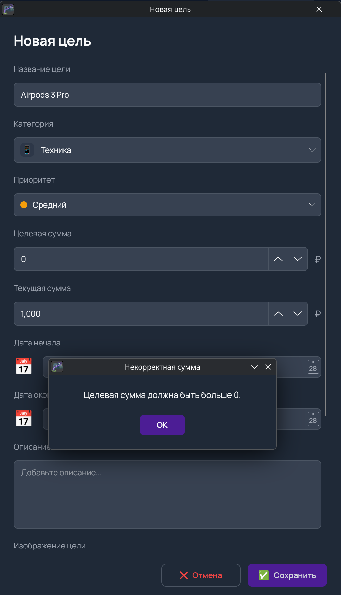](screenshots/12_error_zero_amount.png)
_Контроль корректности введенной суммы_

[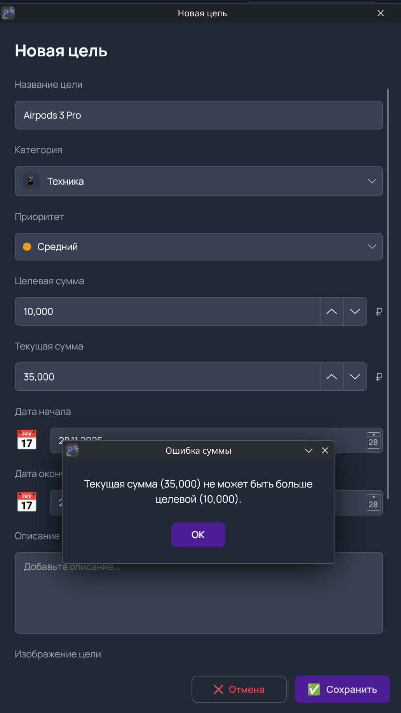](screenshots/13_error_sum_mismatch.png)
_Защита от превышения целевой суммы_
